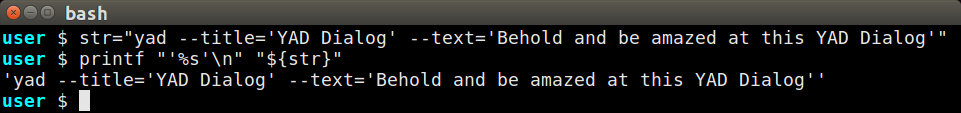
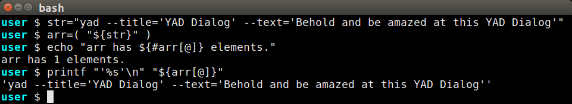
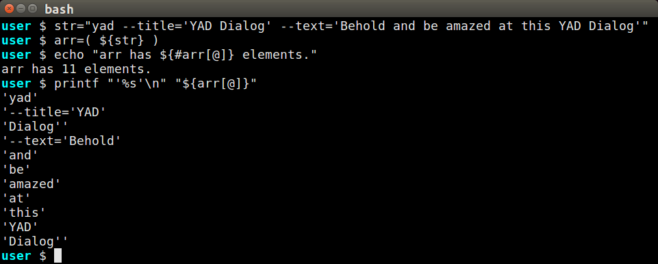
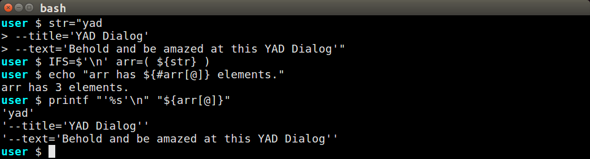
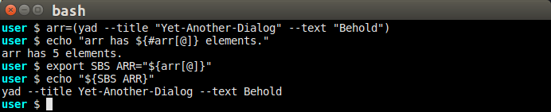
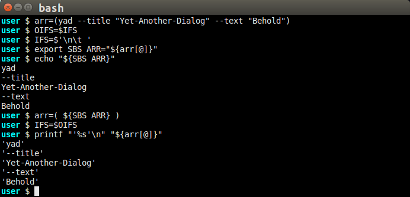
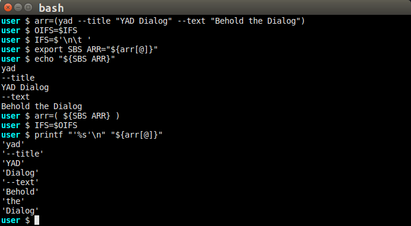
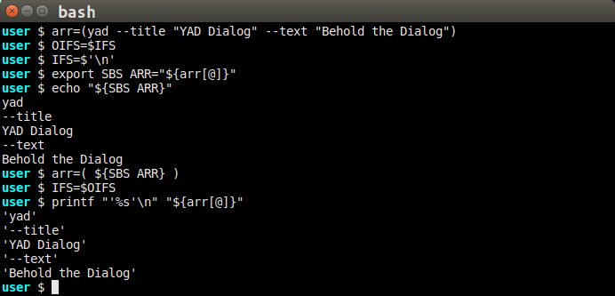
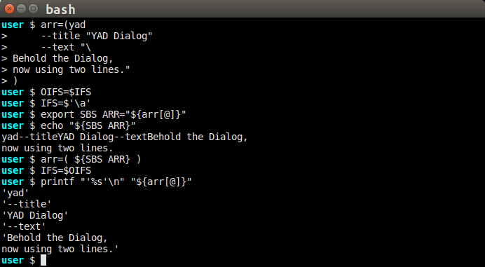

# BASH Arrays

The original purpose of this page was to explain problems with
[saving and restoring BASH arrays](#saving-and-restoring-arrays).
This topic now follows sections on methods for creating arrays and little
traps that may frustrate programmers.  Jump directly to our
[final solution](#handling-intra-string-newlines) to skip all the explanations.

A newer page about [Returning BASH Arrays](bashreturnarray.md) covers some of this
same material as this page, with an emphasis on the delegation of constructing an
array.

## Creating BASH Arrays

There are several ways to create BASH arrays.  Arrays can be created with the simple `( ... )`
syntax, with the `declare` command, and with the `mapfile` (alias `readarray`) commands.
(The `man` information about these commands will be found in the BASH man page.  Use the
**/** search tool to find the topics.)

The examples in [YAD Arrays](yadarrays.md) used the simple `( ... )` notation.  The following
short example will create an array named *cmd* with three elements:

## Experimenting with BASH Variables

To inexperienced programmers, BASH variable handling can seem very particular.  Look at the
following screen print to see how different syntax results in different outcomes.  The examples
will use `printf "'%s'\n"` to show the results of each string substitution.  Using `printf` this
way will separate the elements makes it easier to see what an array element begins and ends.

### Reproducing the Document Images

This repository includes the file `docs/array_scripts.sh` that was used to create the images
found below.  Run the script to create an anonymous console window (ie without user or computer
names) and a `gedit` window with the array_scripts.sh file.   Copy code fragments from the `gedit`
window to the console to run them (copy from gedit with Control-C, then paste into the console
with Shift-Insert).  Type Alt-PrScr to copy a snapshot of the console window to your copy
buffer.

### Experiments Converting a String to an Array

This set of experiments will create a string with three elements.  Different handling of the
string will result in differnt outcomes, as will be illustrated below.

Each experiment will show the count of array elements with `echo "arr has ${#arr[@]} elements"`.
Then it will show the elements themselves  with `printf "'%s'\n" "${arr[@]}"` so that
the apostrophes clearly mark the beginning and end of an array element which may include
newlines that would otherwise be ambiguous.

#### Create and View the String

This first image mainly establishes the contents of the array string.  It includes three
items to create a YAD dialog.  The following experiments will change the construction of
the string and the array.

#### Create Array from String, Quoted Substitution
In this experiment, we begin to use the *array initialization* parentheses with a quoted
variable invocation.  It does not work as we want:

You can see that the array only has a single element, not the three we were hoping for.
Enclosing the variable name with quotes, `arr=( "${str}" )`, forces BASH to treat the
entire string as a single value, thus a single array element.

#### Create Array from String, Unquoted Substitution

In this experiment, we properly leave off the quotes, and BASH dutifully breaks the
string into discrete elements:

Using the unquoted substitution, `arr=( ${str} )` results in too many array elements.
The problem is that BASH is breaking the string on white-space characters, specifically
any space, tab, or newline is taken to signal the beginning of a new element.  Even though
the text strings are enclosed in single-quotes, the enclosed spaces trigger new elements.

#### Setting IFS Value for Better Breaks

Allowing BASH to break the string by spaces, tabs, or newlines is too permissive because
it causes too many breaks.  This experiment introduces newlines into the array source
string, then breaks the array *only* on the newlines:

This is the desired result, an array with three elements.

The **IFS** environment variable dictates how a string is converted to an array.  Any character
in the *IFS* variable will be taken as an element boundary.  The default value of *IFS* of
 `$' \t\n'` means that a space, tab, or newline will begin a new array element.  Also note that
consecutive white space characters will be treated as a single break.

In this example, we have replaced the default *IFS* value with the single newline character,
`IFS=$'\n'` so neither tabs nor spaces will not cause element breaks.  An
important feature of this example is that, by setting *IFS* value on the same line as the
array substitution, the IFS value reverts to the its previous setting when the statement
is finished.

#### Omitting Value String Quotes
Having removed spaces from the list of field separators, we no longer need to use quotes
to keep the sentences together:

This may not be array nirvana, however, depending on how the array elements are used.
The above array works for YAD, but may not work if the target command needs to further break
down the elements because the `--title=YAD Dialog` might be broken into two items,
`title=YAD` and `Dialog`.  In that case, you may have to continue quoting the string.

### Alternate Array Initializations

Besides the `( )` array initialization, BASH has built-in commands that can also create
arrays when the parentheses fall short.  Find these commands in `man bash`, slash-search
for `^SHELL BUILTIN COMMAND`, then from there search for the command.

#### Using *mapfile*

The commands **mapfile** and **readarray** are actually aliases for the same function that
builds an array from a string or a file.  The main advantage the **mapfile** offers is the
options available to tweak construction.  As shown below, **mapfile** is also more forgiving
with the input data, returning the same array whether the string is multi-line or single-line,
and whether the variable is quoted or not.

Find documentation for *mapfile* and *readarray* in `man bash`.

## Saving and Restoring Arrays

BASH provides nice array features that, once mastered, are powerful and easy to use. 
Unfortunately, the BASH shell environment does not support BASH arrays.  This is not a
problem for most cases, but it can be for scripts that contain several functions that might
serve as callbacks.  For example, YAD dialogs can use callback functions that use an array,
but in order for YAD to use the functions, both the functions and the arrays they may access
must be exported to the environment.  Special treatment is required for array data to
pass between the functions.

### Removing the Equals Character

For these examples, we are no longer using the **=** (equals) character to connect the
option name with the option value.  In most commands, and for YAD in particular, the
equals character is not necessary.  Leaving it out now will make some array operations
easier to understand and use.

### Exporting an Array

Our first example shows how the default environment affects the format of an exported array.
Since we earlier covered the impact spaces may have on an array, we are using spaceless
parameters to simplyfy the example.  Be aware of the missing spaces when attempting to
recreate these experiments.

### Export With Altered IFS
When copying the array, BASH uses the first character of the *IFS* environment variable to
separate the array elements.  Normally, the character of *IFS* is a space, so spaces are used
between the elements.  Let's see what happens if we reorder the *IFS* to put the newline first.
(Notice that the *IFS* value is saved and restored.  It is a good practice, with global variables,
to "clean up after yourself" in case another process has changed the *IFS* value and may
need the altered value again.)

### Returning the Spaces
We reintroduce the spaces in the following example.  Notice how the quotes-enclosed phrases
are kept togther on their own lines.  However, when we use the exported variable to restore
the array, the spaces, along with the newline and tab characters, signal new elements.  The
restored array has too many elements.

### Limiting IFS to Newline
To fix the problem with spaces, let's limit *IFS* to a single character, the newline.
The space between the words no longer prompt new array elements.  This is a nice, but
incomplete, solution:

### Handling Intra-string Newlines

This is our final solution for saving and restoring arrays.

We would prefer to have strings include newlines.  When we allow newlines in the string, we
can no longer use newline for the *IFS* value.  We will replace the newline character with
an unreadable character, `\a`, which is the *bell* character.  Do not worry about the
apparent lack of breaks between several of the elements in the printout of SBS_ARG.  It is
the unreadable nature of the `\a` character that makes it unlikely to be used in a text
string and inspires us to use the character as a field separator.

The `\a` character may not be appropriate in all situations.  Feel free to use another
character as the *IFS* value, as long as it is not included in the text being saved.

### Also Look At:

A newer page about [Returning BASH Arrays](bashreturnarray.md) also suggests some successful
methods for saving and restoring BASH arrays.
