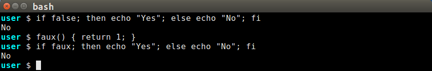

# BASH Conditionals

This is **not** a guide on evaluating BASH conditionals.  There are many
such guides, and the online documentation is very good.  Go down to the
section [Finding Online Help](#finding-online-help)
for hints where to find help with conditional operators.

## Assigning Boolean Value to a Variable

In many situations of a long-running loop, I prefer to assign a boolean
value to a variable and use the variable to dictate the continuation of
the loop, especially when the terminating condition occurs rarely and is
detected while doing other processing within the loop.  In that case,
bypassing the evaluation of a conditional expression at every iteration
should reduce the computational overhead of the loop.  Using a variable
this way may also be preferable if you could replace a conditional
expression that is too long or complicated with an easier-to-read
calculation that sets the conditional variable within the loop.

Sadly, you can't do this in BASH.  While one might argue that you don't
program in BASH if efficiency is a concern, I strive to write elegant
code that is efficient and easy to read.

The BASH commands that process conditional values (*if*, *elif*,
*until*, and *while*) seem only to read the exit status of a function.
The exceptions to this are keywords **true** and **false**, both of
which can trigger the conditional commands.  Besides *true* and *false*,
variables always seem to evaluate to *true*, no matter what the value
of the variable nor how it was set.

### Failed Attempts at Setting a Variable to False

At first, I thought that it was possible to set a variable to *false*,
but after many experiments, I was still unable to set a variable value
that would evaluate as *false* by the BASH conditional commands.  You
can see these experiments in the script `bashconditionals` in the
repository.

Apparently, the BASH conditional commands read the exit status variable
`$?` that is set when a function returns.  An exit status of 0 is
deemed to be *true* and a non-zero value is *false*.  Variables do
not have an exit status property to read.

### Learning From Expressions *true* and *false*

What about *true* and *false*?  I think they may actually be
functions.  Look how using a variable name outside of `[ ]` brackets
draws a warning about its not being a function.

Yet similarly using `if false;` works without expecting a function.
Is this because `false` is a function rather than a variable name?
Let's see what happens if another function can operate like `false`:

### Using a Lambda Function to Control a Loop

The simple `faux` function worked in the previous example, perhaps we
can exploit that syntax with an lambda function:

~~~sh
loop_with_lambda()
{
    local -i limit=10
    local -i ndx=0
    keep_looping() { (( ndx++ )); [ "$ndx" -le "$limit" ]; }

    while keep_looping; do
        echo "ndx = $ndx"
    done
}

loop_with_lambda
~~~

To be sure, using a `for (( ndx=0; ndx<10; ndx++  ))` would be more
idiomatic expression than the while loop in the example, as would a
set of results that begin with 0 and end with 9.  However, the
example shows an alternative to using `[ "$ndx" -lt "$limit" ]` that
both changes and checks the values.

It seems peculiar to increment *ndx* before checking the condition,
but we have to increment first so the return value is the result of
the conditional expression.  To check the condition before incrementing,
an alternate expression of `keep_looping` would more closely emulate
the `for (( ))` expression:

~~~sh
keep_looping() { local -i exval; [ "ndx" -le "$limit" ]; exval=$?; (( ndx++ )) }
~~~

If that simple example does not illustrate how useful it could be to use
a function for a loop condition, consider the replacing `keep_looping`
above with the following conditional function:

~~~sh
keep_looping()
{
   # Special parameter allows infinite loop
   if [ $1 == "infinite" ]; then
      return 0
   fi

   # Administrator always keeps looping
   if [ "$USER" == "administrator" ]; then
      return 0
   fi

   # Non-administrator only loops before noon
   local -i now=$( date +"%H%M%S" )
   if [ $now -lt 120000 ]; then
      return 0
   fi

   return 1
}
~~~

It's much easier to read these arbitrary conditions that terminate
the loop.

## Finding Online Help

- Basic operator documentation
  - `man test` explains conditional operators
  - `help test` summarizes conditional operators
  - `help [[` (especially for regular expressions)

- Regular Expression documentation
  - `man 7 regex` regular expression syntax.  Not much help for
    learning regular expressions, but useful documentation for
    matching character classes and which characters must be escaped.

