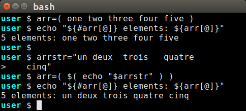
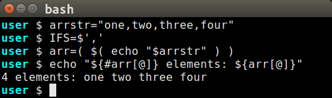
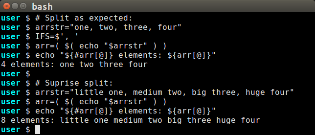
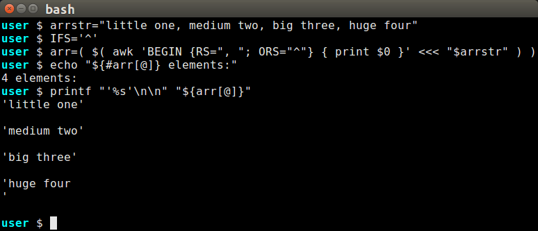
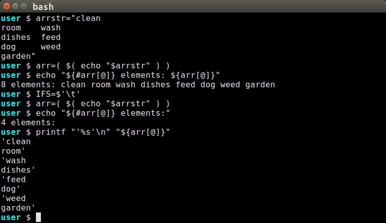
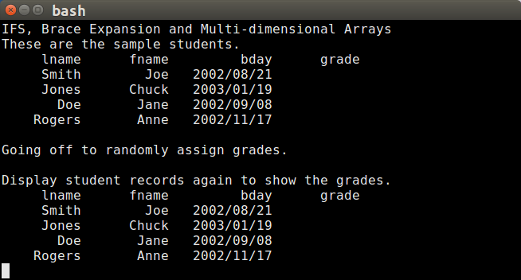

# BASH Arrays With IFS

## Introduction to IFS

The **IFS** (**I**nternal **F**ield **S**eparator) environment variable
dictates how strings will be interpreted.  The *IFS* variable is used
when reading an input and also when expanding an array to a string
variable.  Understanding how the *IFS* value affects certain operations
provides a programmer with a powerful tool for solving several BASH
programming challenges.

## Creating BASH Arrays

The easiest way to create arrays is to use the `( )` compound command
(Search for Compound Commands in the BASH man page).  A list of items
enclosed in single parentheses will be saved as an array.  Notice how
the increasing number of spaces and even the embedded newline among
spaces between *quatre* and *cinq* still results in a five-element array:

### IFS For Creating an Array

The default *IFS* character consists of three characters, a space, a tab,
and a newline.  When processing a string, a character that matches
**any** of the *IFS* characters is considered a field separator.
Consecutive separators will collapsed into a single separation, as is
illustrated in the second experiment in the first image above.
Even though there is an increasing number of spaces between the
french numbers, the resulting array still consists of five elements.

### Changing IFS for Comma-Separated Values (CSV)

Changing the *IFS* value allows a program to split a string on an
arbitrary character.  A CSV line is a prime example of how this would
work:

### IFS Multi-Character Trap

A novice BASH programmer might assign a string to the *IFS*, expecting
that BASH will split a string on the substring.  That this is a mistake
may not be obvious.  A programmer might want to split on a comma followed
by a space, setting IFS to this string: `IFS=$', '`.  Consider the two
arrays below:

The programmer might think the *IFS* is working as expected when it is
applied to the first sample string, splitting the string into four array
elements.  The trap occurs when the programmer expects the string is
being split on the substring that matches the IFS.  If the string was
split on the substring, the second string would be split into four
array elements, just like the first string.  However, since any *IFS*
character splits a string, the space between *little* and *one* is also
interpreted as a separator, resulting in eight array elements.

#### Alternative for Substring Separator Matching

Although builtin BASH commands cannot split a string on a substring,
the widely-available **awk** program can handle the substring split.

While this is not a tutorial on *awk*, here are a few points explaining
how this *awk* statement works.  Some information here is not covered
until later on this page:
- We split the string into records from which to create the array
  elements so the constituent words of each element are interpreted as
  fields and thus grouped together.
- The *RS* field can contain multiple characters which match as a whole,
  unlike *IFS*.
- The *IFS* and *ORS* have the same value to signal where the splits
  will occur in the `( )` command.
- In *awk*, `print $0` prints the entire record match.
  `print $1` would have printed
  the first fields, *little*, *medium*, *big*, and *huge*.
- I used `printf` with single quotes and double newlines to clearly
  show where the elements begin and end.
- The single quotes reveal the problem with the final element: it has
  a trailing newline.

### IFS to Capture Multiline Elements

With the default *IFS* value, a newline is treated the same as a space
and a tab.  There are situations where an element might include a
newline.

To retain the embedded newlines, remove the newline character from the
*IFS* string.  In the following example, tabs separate the elements.
The default *IFS* value (space/tab/newline) splits at the tabs *and*
the newlines embedded in the task strings.  Changing the *IFS* to
tab alone changes the `( )` command behavior and we see the desired
array.

## BASH Array Expansion

BASH array elements are accessed with brace `${ }` expansions.  The
brace expansion might return a single element, a slice of elements,
or the whole collection.

- Return a single element with a brace expansion that includes a
  bracketed index value.  For example, `"${arr[0]}"` returns the 
  first element of the **arr** array.  Remember, arrays start counting
  at 0.
- Return a subset of elements using the brace expansion with the
  array name and indexes set off with colons.  For example, 
  `"${arr:2}"` will return the third array element and all elements
  following it.  `"${arr:2:3}"` will return a set of 3 array elements,
  starting with the third.
- Return all the elements with `"${arr[@]}"` or `"${arr[*]}"`.
- If the index is left off, the first element is returned.  That is,
  `"${arr}"` is the same as `"${arr[0]}"`.

### Array Brace Expansion to Function

If one of the multiple-selection brace expansions are passed to a
function, each of the elements will be passed as a separate command
parameter.  Using this convention will result in an index-addressable
array in the function by addressing the parameters.

~~~sh
seek_index()
{
   local el target="$1"
   local -i ndx=0
   
   for el in "${@:2}"; do
      if [ "$el" == "$target" ]; then
         echo "${ndx}"
         return 0
      fi
      (( ndx++ ))
   done

   return 1
}

# Use the index-seeking function with an array expansion:
declare result
declare -a arr=(one two three four five)
result=$( seek_index "one" "${arr[@]}" )
if [ $? -eq 0 ]; then
   echo "'one' is at index $result in the array."
else
   echo "'one' was not found in the array."
fi
~~~

### IFS, Brace Expansion, and Multi-dimensional Arrays

When using the `"${arr[*]}"` expansion (with the asterisk), the first
character of the *IFS* variable is used to separate the array elements.
This can be useful to implement multi-dimensional arrays.

The following defines an array of id-indexed student records, with an
additional field name array for field position reference and as a
table header.  Notice how the student fields are separated by the
caret character (^).  We will use IFS and brace expansion to manipulate
the information in each record.

~~~sh
declare -a grade_letters=( A B C D F )
declare -a fields=( lname fname bday grade )
declare -A students=(
        [1234]="Smith^Joe^2002/08/21^^"
        [1235]="Jones^Chuck^2003/01/19^^"
        [1236]="Doe^Jane^2002/09/08^^"
        [1237]="Rogers^Anne^2002/11/17^^"
        )
~~~

Display student records in a table.  Notice how the string assigned
to each associated array element is unpacked
~~~sh
show_students()
{
   local stuid
   local -a rec
   local IFS

   # Reusable format string for column consistency:
   local fmat="%10s %10s %12s %10s\n"

   # Table header
   printf "${fmat}" "${fields[@]}"

   for stuid in "${!students[@]}"; do
      # Unpack student record into an array:
      IFS="^"
      rec=( $( echo "${students[$stuid]}" ) )
      printf "${fmat}" "${rec[@]}"
   done
}
~~~

Assign random grades to the students.  Again, we unpack the
student records with the appropriate field separator.  However,
in this case we make a change to the record and resave it.

Note that this function uses an earlier defined function, *seek_index*,
that we use here to confirm the index of then *grade* field.
~~~sh
# This function takes advantage of direct access to
# variables in the calling function's scope.
assign_student_grades()
{
   local stuid
   local -a rec
   local -i grade ndxGrade
   local IFS

   ndxGrade=$( seek_index "grade" "${fields[@]}" )
   if [ $? -ne 0 ]; then
       echo "seek_index failed to find 'grade' field." >&2
       exit 1
   fi

   for stuid in "${!students[@]}"; do
      # Unpack student record into an array:
      IFS="^"
      rec=( $( echo "${students[$stuid]}" ) )

      # Randomly assign a letter grade:
      grade=$(( $RANDOM % 4 ))
      rec[$ndxGrade]="${grade_letters[$grade]}"

      # Update the main array with changed record:
      # Note that the ^ IFS value will again use
      # the ^ to separate the elements.
      students[$stuid]="${rec[*]}"
   done
}
~~~

The following function puts these parts together to confirm that
the ideas we're using work as expected:

~~~sh
multid_demo()
{
    declare -a fields=( lname fname bday grade )
    declare -A students=(
        [1234]="Smith^Joe^2002/08/21^^"
        [1235]="Jones^Chuck^2003/01/19^^"
        [1236]="Doe^Jane^2002/09/08^^"
        [1237]="Rogers^Anne^2002/11/17^^"
    )

    echo "These are the sample students."
    show_students

    echo
    echo "Going off to randomly assign grades."
    assign_student_grades

    echo
    echo "Display student records again to show the grades."
    show_students
}

multid_demo
~~~

The output of calling `multid_demo`:

