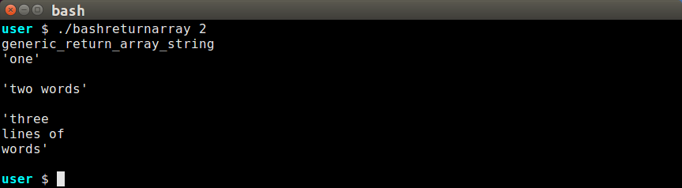
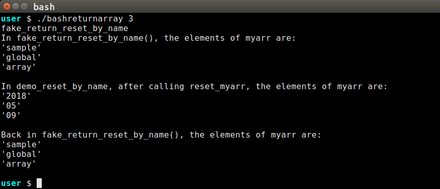
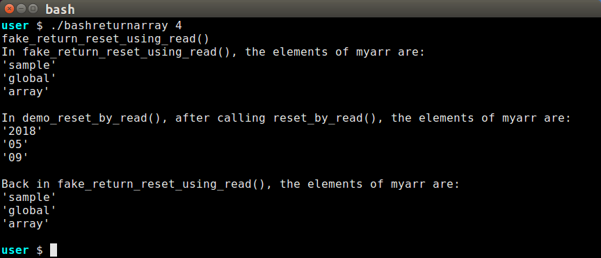

# Returning BASH Arrays

We have [discussed](yadarrays.md) that BASH arrays are helpful for organizing the large number
of parameters needed to create any but the most trivial YAD dialogs.

## The Benefits of Returned Arrays

There are several reason why I would like BASH to return arrays:
- It is easier to manage the lifetime of arrays when they are locally allocated.
- Getting arrays from functions allows for just-in-time acquisition.  
- The names of functions that return arrays can be used to help document algorithms strategies.

## BASH Cannot Return an Array!

Sadly, despite all the advantages
In order to break up the task of collecting all the necessary parameters for a YAD call, it
is helpful to call several functions to build up the arrays.  However, BASH lacks the ability
to return arrays from functions.

## Good-enough Alternatives to Returning Arrays

There are two main alternatives to returning arrays, either of which provide the benefits I
mentioned above.
- [returning-an-array-building-string](Function returns a string that can be parsed into the desired array.)
  This is my recommended solution for simulating the return of an array. See
  [Multiline Elements Defeat Indirect Array Copy](multiline-elements-defeat-indirect-array-copy) for
  an explanation.

- [construct-array-at-name](Assigning a new array to an existing array in the calling function's scope.)
  This most closely mimics the semantics of a function returning an array.  I have created several
  working examples, and have abandoned many more failed experiments.  In short, these methods can work,
  but not when elements include embedded newlines.  Working experiments:
  - Warning, [Multiline Elements Defeat Indirect Array Copy](multiline-elements-defeat-indirect-array-copy) for
  - [copy-to-a-known-variable-name](Assign new array to a hard-coded variable name.)
  - [copy-array-to-indirect-variable-name](Copy array to an indirect variable name.)

## Code Samples

The code samples below have been tested in the **bashreturnarray** script that can be found
in the repository.  Each output image will include the command that produced the output of
which the image is a record, in case you want to experiment with it.

In order to facilitate the reading of the code, the code on this page may be abbreviated in
relation to the code in the script.

## Returning An Array-Building String

This is actually a pretty easy method to use.  The main drawback is that the return value
is not directly usable, but requires action by the calling function before the array is
ready for use.

In the following example, please note:

In function `return_array_building_string()`,
- **ESEP** stands for Element SEParator, and is taken from a parameter sent by the
  function that uses the output to ensure agreement between the character used to
  separate the elements during printing and during reconstruction.
- Build array with **IFS** set to single newline, leaving out space and tab.
  This setting will prevent BASH from splitting on tabs and, particularly, spaces.
- The quotes around sets of words keeps the words together, despite embedded newlines.
- We set **IFS** to the **ESEP** value for the brace expansion on the final line.
- We use `"$arr[*]}"` because brace expansion with __*__ uses the first *IFS* character
  to separate values, rather than the spaces that separate brace expansion with **@**.

In function `simple_return_array_string()`,
- **ESEP** is more plausibly set here, where the value is used as the **IFS** value **and**
  as the parameter when calling *return_array_building_string()*.
- The array is complete with the array-construction operators `()` enclosing the subshell
  operators `$()` that return the array string with elements separated by the **ESEP** value.
- The `printf "'%s'\n\n" "${locarr[@]}" encloses each element with apostrophes to show the
  extent of the element, especially the three-line element.  Two newlines follow each element
  to 

~~~sh
return_array_building_string()
{
   local ESEP="$1"

   local IFS=$'\n'

    local -a arr=(
        "one"
        "two words"
        "three
lines of
words"
    )

   IFS="${ESEP}"
   echo "${arr[*]}"
}

simple_return_array_string()
{
   local ESEP=$'\a'
   local IFS="${ESEP}"
   local -a locarr=( $( return_array_building_string "${ESEP}" ) )

   # Separating elements by two newlines to highlight that
   # the two-line element preserved the newline:
   printf "'%s'\n\n" "${locarr[@]}"
}
~~~

And this is the output:

### Using a Generic Array String Builder

BASH parameter handling is related to array handling, and that makes it very easy to write
a generic function for constructing an array string from an array.

In the following three functions that form this experiment, please note:

The function `generic_array_string_builder()`
- Expects to be invoked with a separator value and an array expansion.
- Processes the incoming parameters as an array starting at the second parameter.
- Uses the first parameter as the element separator.
- Like previous experiment, takes advantage the asterisk/brace expansion to add
  the separators.

The function `return_array_building_string_with_generic_function()`
- Works like *return_array_building_string()* in previous experiment, but delegates the
  actual output to *generic_array_string_builder()*.

The function `generic_return_array_string()` is identical to *simple_return_array_string()*
except for the function being called in the `$()`.

~~~sh
generic_array_string_builder()
{
    local IFS="$1"
    echo "${*:2}"
}

return_array_building_string_with_generic_function()
{
    local IFS="$1"
    local -a arr=(
        "one"
        "two words"
        "three
lines of
words"
    )

    generic_array_string_builder "${IFS}" "${arr[@]}"
}

generic_return_array_string()
{
    local ESEP=$'\a'
    local IFS="${ESEP}"
    local -a locarr=( $( return_array_building_string_with_generic_function "${ESEP}" ) )
    printf "'%s'\n\n" "${locarr[@]}"
}
~~~

## Construct Array At Name

As said before, you can't really return an array in BASH.  What we *can* do is reset a
variable that already exists in the calling function's scope.  Using this idea simluates
a function return because after the function that needs the array calls the function that
supplies the array, the calling function can find the array in a local variable.

### Copy to a Known Variable Name

This is very easy for any array if the target array's name is used directly in the
array-supplying function.  In the following example, the fake return effect of calling
function `reset_myarr` is apparent in how the reset value of *myarr* is only valid in
the scope of function `demo_reset_by_name()`.  Before and after calling `demo_reset_by_name()`,
you can see that the global value of *myarr* is current.

~~~sh
# Set a global array value to test variable lifetimes.
myarr=( sample global array )

reset_myarr()
{
   myarr=( $( date +"%Y %m %d" ) )
}

demo_reset_by_name()
{
   local -a myarr
   reset_myarr

   echo "In demo_reset_by_name(), after calling reset_myarr(), the elements of myarr are:"
   printf "'%s'\n" "${myarr[@]}"
   echo
}

fake_return_reset_by_name()
{
    echo "In fake_return_reset_by_name(), the elements of myarr are:"
    printf "'%s'\n" "${myarr[@]}"
    echo

    demo_reset_by_name

    echo "Back in fake_return_reset_by_name(), the elements of myarr are:"
    printf "'%s'\n" "${myarr[@]}"
    echo
}
~~~

### Copy Array to Indirect Variable Name

There are problems with copying to a hard-coded name, particularly in larger BASH programs.
The fixed name might collide with another variable name.  It may be complicated to plan
several names to prevent collisions.  It would be most convenient to indicate the target
variable name when calling the array-copying function.  As we will see below, BASH makes
it complicated to change an array by a variable's name.

In these experiments, we pass the local array name as a parameter to the array-building function.
Then the array-building function sets up the array using an indirect reference.  The problem
with this is that most BASH assignments will not work with an indirect assignment.  There are
a few functions that take the variable name as a parameter:

- printf
- the declare family (including declare, local, and readonly)
- read
- mapfile/readarray

#### Failing Before We Start: *printf* and *declare*

The builtin functions **printf** and the **declare** family will not work for our purposes.
Although *printf* can write to a variable with the `-v` option, it cannot write out an array.
The *declare* family *can* create arrays, but variables written with the *declare* family are
local to the function in which they are declared.  The local variable will obscure the
synonymous name in the calling function.

#### Multiline Elements Defeat Indirect Array Copy

Before we go any further, I want to make it clear that none of these methods support copying
multiline array elements.  The builtin functions that support copying to a brace-expanded variable
name, **read** and **mapfile**/**readarray**, read input by the line.  As soon as either of the
functions encounter a newline, the input is considered complete and the array is truncated at
that point.

I ran many experiments attempting to overcome this limitation.  Both using `printf "%q\n"` and
temporarily changing embedded newlines to a control character then changing back later failed
even after many creative (if I do say so myself) attempts.  It did work to count the indexes
and assign each array element with `eval` but the contortions required to do that far outweighed
the semantic benefit of copying to an indirect variable name.  In short, I strongly recommend
using the [return an array-building string](returning-an-array-building-string) method for all
cases where you might want to return an array.

#### Indirect Variable Access With *read*

The builtin function **read** reads a line of text from stdin, and always writes to a named 
variable.  Using the `-a` option directs the function to write an array.  This set of functions
works like [Copy to a Known Variable Name](copy-to-a-known-variable-name) to demonstrate the
lifetime of the array.

~~~sh
# Set a global array value to test variable lifetimes.
myarr=( sample global array )

reset_by_read()
{
    target="$1"
    arr=( $( date +"%Y %m %d" ) )

    read -a "${target}" < <( echo "${arr[@]}" )
}

demo_reset_by_read()
{
    local -a myarr
    reset_by_read "myarr"

    echo "In demo_reset_by_read(), after calling reset_by_read(), the elements of myarr are:"
    printf "'%s'\n" "${myarr[@]}"
    echo
}

fake_return_reset_using_read()
{
    echo "In fake_return_reset_using_read(), the elements of myarr are:"
    printf "'%s'\n" "${myarr[@]}"
    echo

    demo_reset_by_read "myarr"

    echo "Back in fake_return_reset_using_read(), the elements of myarr are:"
    printf "'%s'\n" "${myarr[@]}"
    echo
}
~~~

The builtin function **mapfile** is similar to **read** in that it reads from stdin to create an
array, the name of which can be a brace expansion.  The **mapfile** function assigns each line of
a file to a new array element, so extra steps are required to present the data thusly to the
function.

One requirement is to change the *IFS* value to a single newline character just before using
the *echo* command to expand the array.  The second requirement is to use the __*__ for the
wildcard instead of the __@__, to ensure the *IFS* character is used to separate the elements.

The `-t` option removes the separating newline that is otherwise included with each array
element.

The final requirement is to the the `< <()` notation to submit the array to *mapfile*.
Using a pipe doesn't work with *mapfile*.

You can perform your own experiments with the *bashreturnarray* script file by changing the
commented code to see how the changes affect the output.

~~~sh
# Set a global array value to test variable lifetimes.
myarr=( sample global array )

reset_by_mapfile()
{
    target="$1"
    arr=( $( date +"%Y %m %d" ) )

    # This construction does not work, result is no elements
    # echo "${arr[@]}" | mapfile -t "${target}"

    # This construction does not work, result is single element with spaces
    # mapfile -t "${target}" < <( echo "${arr[@]}" )
    
    # This is the proper construction.
    local IFS=$'\n'
    mapfile -t "${target}" < <( echo "${arr[*]}" )
}

demo_reset_by_mapfile()
{
    local -a myarr
    reset_by_mapfile "myarr"

    echo "In demo_reset_by_mapfile(), after calling reset_by_mapfile(), the elements of myarr:"
    printf "'%s'\n" "${myarr[@]}"
    echo
}

fake_return_reset_using_mapfile()
{
    echo "In fake_return_reset_using_mapfile(), the elements of myarr:"
    printf "'%s'\n" "${myarr[@]}"
    echo

    demo_reset_by_mapfile "myarr"

    echo "Back in fake_return_reset_using_mapfile(), the elements of myarr:"
    printf "'%s'\n" "${myarr[@]}"
    echo
}
~~~

