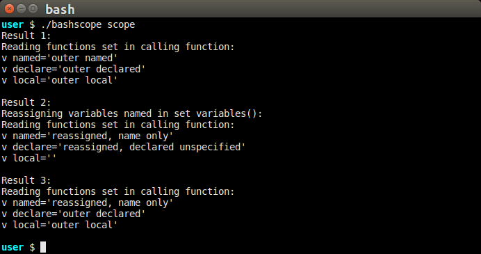
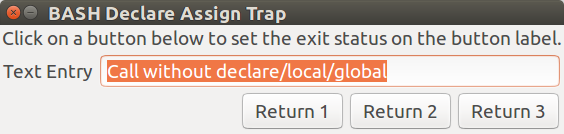
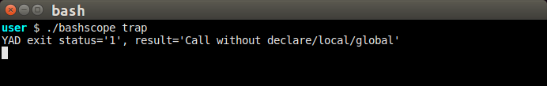
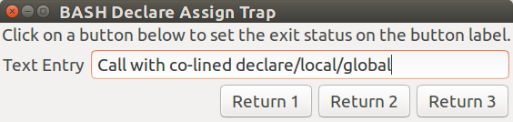
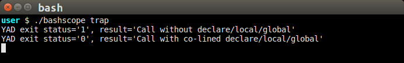
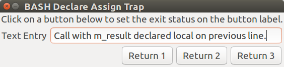

# BASH Scope Traps

This page explores and attempts to explain some mysterious BASH behavior.  While
the page may grow to include more topics, initially it covers
- [Cascading Variable Scope](#cascading-variable-scope)
- [The Declare Trap](#the-declare-trap)

The experiments on this page can be reproduced by running the *bashscope* program
included in the repository.

## Cascading Variable Scope

In most programming languages, variables declared in a local scope are private to
that scope.  The variables can be accessed by passing a pointer or reference to the
variable to a function, but otherwise, attempts to access the variable is impossible.

In BASH, however, the variables **are** visible to called functions.  Attempting to
create function-private variables, and to confirm my understanding of variable scope
in BASH, I ran the following experiments.

Function **set_variables** uses different methods to set three variables, trying to
hide them from the function **show_caller_variables** which is called to test the 
visibility of the variables.

~~~sh
set_variables()
{
    v_named="outer_named"
    declare v_declare="outer_declared"
    local v_local="outer_local"

    echo "Result 1:"
    show_caller_variables

    echo "Result 2:"
    reassign_variables

    echo "Result 3:"
    show_caller_variables
}

show_caller_variables()
{
    echo "Reading functions set in calling function:"
    echo "v_named='${v_named}'"
    echo "v_declare='${v_declare}'"
    echo "v_local='${v_local}'"
    echo
}

reassign_variables()
{
    echo "Reassigning variables named in set_variables():"
    v_named="reassigned, name only"
    declare v_declare="reassigned, declared unspecified" 
    local v_local

    show_caller_variables
}

set_variables
~~~

In **Result 1**, *show_caller_variables* is called after the variables are set, showing
that all of the variables are visible to the called function, despite being declared as
*local*.

Then we call **reassign_variables** to set the variables to new values, calling
*show_caller_variables* to display the results.  Notice how *reassign_variables* uses
three methods to set the new values, by name, by declare, and then by clearing the
*v_local* variable.  **Result 2** is the output of *show_caller_variables* called from
within *reassign_variables*.

Returning to *set_variables* after *reassign_variables*, we again call *show_caller_variables*
to see which, if any, variables retain the values set in *reassign_variables*.  The results
are visible as **Result 3** in the output window.  Sanity is somewhat restored, as the
variables whose values were set with *declare* and *local* show their original values,
indicating that declared variables in a called scope shadow those in the caller's scope.
By reassigning a value by simply referencing the variable name, as we did when setting the
*v_named* variable, we changed the variable in the calling function.

## The Declare Trap

It is common for programs to declare and set a variable's initial value in a single code
statement.  For the most part, this construction also works in BASH, but the practice can
lead to problems in a specific case.

I fell into this trap when I was attempting to isolate the unexpected variable scopes
in called functions.  When attempting to debug seemingly random behavior with a BASH script
using YAD, I eventually discovered that it was always returning 0, despite actions that
should have returned something else.

This set of experiments uses a common set of YAD options, changing only the entry text
to identify which experiment was being run.  The buttons terminate the dialog, setting
the exit status value to the number on the label (YAD uses the value after the colon).

~~~sh
demo_declare_trap()
{
    cmd=(
        --title="BASH Declare Assign Trap"
        --fixed
        --center
        --text="Click on a button below to set the exit status on the button label."
        --entry
        --entry-label "Text Entry"
        --entry-text "Text to return. Replace it if you want to."
        --always-print-result
        --button="Return 1":1
        --button="Return 2":2
        --button="Return 3":3
    )

    # Experiment 1: Variable result used without declaration:
    result=$( yad "${cmd[@]}" --entry-text "Call without declare/local/global" )
    exval=$?
    echo "YAD exit status='$exval', result='${result}'"

    # Experiment 2: Variable l_result declared (as local) on same line as the subshell assignment:
    local l_result=$( yad "${cmd[@]}" --entry-text "Call with co-lined declare/local/global" )
    exval=$?
    echo "YAD exit status='$exval', result='${l_result}'"

    # Experiment 3: Variable m_result declared on a separate line from the subshell assignment:
    local m_result
    m_result=$( yad "${cmd[@]}" --entry-text "Call with m_result declared local on previous line." )
    exval=$?
    echo "YAD exit status='$exval', result='${m_result}'"
}
~~~

For the following experiments, please refer to the BASH script code above to see how
the variable assignments are being made.

### Experiment 1: Variable Instantiation and Assignment on One Line

In the first experiment, we assign the subshell results to a new variable name:
and the we get the expected exit status.

### Experiment 2: Variable Instantiation and Assignment on One Line, Using Declare

The second experiment is the recreation of the situation that tripped me up.  The variable
*l_result* is declared and assigned on the same line.  Even though I used button 2 to exit
the dialog, the exit status after the line was 0, as shown in the console image below.
The user response is thus unknown.

### Experiment 3: Separate Variable Instantiation Line From Assignment Line

This experiment preserves the properties of using *declare* without disturbing the
exit status.

## Explanation

In my code, after which experiment 2 is modeled, I finally realized that the statement always
had the exit status set to 0, `[ $? -eq 0 ]`.  When
studying the BASH documentation, I finally read the following that explained where I was
going wrong:

The *declare* command returns its own exit status.  This exit status was hiding the exit status
of the YAD command.  In the first experiment, the assignment happened without triggering a
new exit status, so the YAD exit status value was not disturbed.  In experiment 3, putting the
*local* declaration on the line above the assignment prevents the *local* command from resetting
the exit status returned by YAD.