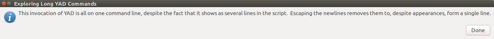
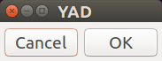
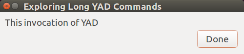

# YAD Arrays

I often invoke YAD with the options in an indexed array.   It's nicer to look at an
array than an extended line with escaped newlines.  I also use an array to collect
common YAD options to facilitate a constant look among the YAD dialogs in an 
application.

This document includes the following topics:
- [Breaking-up YAD Commands](#breaking-up-yad-commands)
- [Break Long Commands With Escaped Newlines](#break-long-commands-with-escaped-newlines)
- [Problems with Escaping Newlines](#problems-with-escaping-newlines)
- [Break Long Commands With Arrays](#break-long-commands-with-arrays)
- [The Problem with Arrays](#the-problem-with-arrays)

## Breaking-up YAD Commands

YAD commands are typically very long, often with many dozens of options and text
parameters used to create useful dialogs.  Submitting these command presents a
usability problem: it can be very difficult to manage very long command lines.
The very long text will wrap over several lines or will be truncated (cut-short)
to to fit within the borders of the editing or shell window.  Wrapped or truncated
lines are hard to read, and it is tedious to position a cursor within a long string
to make changes.

### Break Long Commands With Escaped Newlines

A shell generally executes a command when it receives a newline (when the user presses
the ENTER or RETURN key).  To help reading very long command line calls, the shell will
disregard a newline that is immediately preceded by a backslash character.  A newline
prepared this way is called an *escaped newline*.  Escaping newlines in a long YAD
invocation makes the command much easier to read and edit:

~~~sh
yad --center \
    --image=gtk-dialog-info \
    --borders=10 \
    --width=500 \
    --fixed \
    --title="Exploring Long YAD Commands" \
    --button="Done":1 \
    --text="\
This invocation of YAD is all on one command line, despite the \
fact that it shows as several lines in the script.  Escaping the \
newlines removes them to, despite appearances, form a single line."
~~~

### Problems with Escaping Newlines

The problem with newline escaping is that it is a fragile construction.  The formatting
hides the fact that everything is on a single line, so simple errors can disrupt the
command.

Invisible errors may also break the string:

- A programmer may fail to notice a missing backslash when scanning the code.
- A space following the line-ending backslash causes the space to be escaped instead
  of the newline, which now terminates the line and the command.

Representing a single command with multiple lines in an editor may tempt a programmer to
insert a comment character to temporarily remove a line.  In that case, the command will
be terminated just before the comment, as illustrated in this example:

~~~sh
yad --center \
    # --image=gtk-dialog-info \
    --borders=10 \
    --width=500 \
    --fixed \
    --title="Exploring Long YAD Commands" \
    --button="Done":1 \
    --text="\
This invocation of YAD is all on one command line, despite the \
fact that it shows as several lines in the script.  Escaping the \
newlines removes them to, despite appearances, form a single line."
~~~

Not only is the icon removed, but the other options are also missing.  Notice that the caption
and buttons have reverted to the default settings, and the dialog text is missing.

### Break Long Commands With Arrays

Creating an array to collect the options is a useful alternative.  The array can be
formatted similar to the escaped newline method to be pleasing to read and easier to edit.
Although the array elements span several lines, they are expanded on a single line when
presented to the shell.  Array elements can be individually commented-out, and newlines that
are missing or badly-formed will not terminate the command.

Compare the following example to the previous examples:

Using an array to collect the options, then expand to generate the dialog.
~~~sh
# Create the options array
cmd=(
   --center
   # --image=gtk-dialog-info
   --borders=10
   --width=500
   --fixed
   --title="Exploring Long YAD Commands"
   --button="Done":1
   --text="This invocation of YAD"
)

# Invoke YAD, supplying the options by expanding the array:
yad "${cmd[@]}"
~~~

The commented-out `--image` option removed the icon from the dialog, like we tried to do in the
previous example.  However, in this case, the other options were faithfully submitted and are
represented in the dialog.

### The Problem with Arrays

If you accept the argument in favor of using arrays for YAD options, you may be disappointed
that arrays bring their own problems.  In particular, it is not possible for a function to
return an array, and it is not possible to export an array 

The challenge with sharing arrays among BASH scripts and exported functions is that
BASH cannot save an array to an environment variable.  The [BASH Arrays](basharrays.md)
guide shows how I solved this problem.
