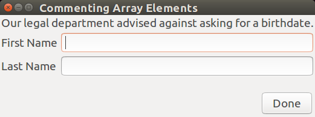
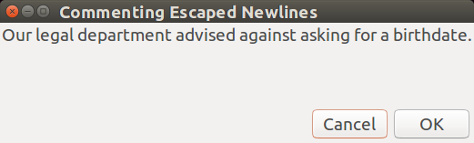

# YAD Arrays

I often invoke YAD with the options in an indexed array.   It's nicer to look at an
array than an extended line with escaped newlines.  I also use an array to collect
common YAD options to facilitate a constant look among the YAD dialogs in an 
application.

Here is an example that shows the difference between calling YAD directly or with an
array of options:

~~~sh
#!/bin/bash

# First method: directly call YAD with explicit options:
yad --center \
    --borders=10 \
    --width=500 \
    --height=600 \
    --title="Exploring BASH Arrays" \
    --button="Done":1 \
    --text="\
This invocation of YAD is all on one command line, despite the \
fact that it shows as several lines in the script.  Escaping the \
newlines removes them to, despite appearances, form a single line."

# Create an array of YAD options:
cmd=(
   --center
   --borders=10
   --width=500
   --height=600    
   --title="Exploring BASH Arrays" 
   --button="Done":1
)

# Second method: Invoke YAD, supplying the options by expanding the array:
yad "${cmd[@]}" --text="This invocation of YAD"
~~~

BASH executes a command when it encounters a newline, so commands cannot extend to a second
line.  For formatting purposes, it is allowed to escape the newline by ending a line with a
backslash, as can be see in the first method of the example script.

### The Problem with Escaping Newlines

Escaping the newlines works fine, but invisible errors can sabotage the command execution.
First, it may be hard to notice a missing backslash on one of the lines, and even more
insidious, if a space follows the backslash, the backslash will escape the space and not
the newline.  In either of these cases, the command will not receive the options that 
follow the unescaped newline.  Compounding the problem, there may be no obvious errors in
the dialog resulting from the incomplete command.  Invisible errors and symptoms make for
difficult debugging.

### Advantages of Using Arrays

Besides being easier to read array-formatted command lines, it's also easier to combine
multiple arrays or to temporarily comment out individual options.

~~~sh
cmd=(
    # --text="Please fill out the following survey for a prize."
    --text="Our legal department advised against asking for a birthdate."
    --form
    --field="First Name" ""
    --field="Last Name" ""
    # --field="Birthday":DT "1960/04/21"
    --button="Done":1
)
~~~

Notice how commenting the first of the text options did not prevent the reading of the following
options.  If we had created a long line by escaping newlines, the options following the first
commented newline would be ignored:

~~~sh
yad \
    --title="Commenting Escaped Newlines" \
    # --text="Please fill out the following survey for a prize." \
    --text="Our legal department advised against asking for a birthdate." \
    --form \
    --field="First Name" "" \
    --field="Last Name" "" \
    # --field="Birthday":DT "1960/04/21" \
    --button="Done":1
~~~

Notice that the options that follow the commented text are lost.  No longer explicitely calling
for a **Done** button, YAD falls back to the default **Cancel** and **OK** buttons.

### The Problem with Arrays

If you accept the argument in favor of using arrays for YAD options, you may be disappointed
that arrays bring their own problems.  In particular, it is not possible for a function to
return an array, and it is not possible to export an array 

The challenge with sharing arrays among BASH scripts and exported functions is that
BASH cannot save an array to an environment variable.  The [BASH Arrays](docs/basharrays.md)
guide shows how I solved this problem.
