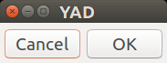

# YAD Button Processing

## Kinds of YAD Buttons

There are two kinds of YAD buttons, **dialog buttons** and **form buttons**.  They are created
differently and are hosted in different parts of a YAD dialog.

### Dialog Buttons

- are arrayed along the bottom of the dialog
- are included by default (can be added to, changed, or omitted)
- terminate the dialog (can call command instead)
- signal the calling function through the exit value

### Form Buttons

- are positioned vertically in line with other form elements
- must be explicitly included
- always call another function
- never terminate the YAD dialog (I tried to make it do this).

For questions not answered in this guide, refer also to
[The Buttons of YAD](http://www.thelinuxrain.com/articles/the-buttons-of-yad)
and [this page](http://smokey01.com/yad/).  They may contain information not
covered in this guide.

### Script *yadbuttons*

Pressing the button labelled *YAD Button Processing* on the main dialog will open a new
YAD dialog with buttons labelled according to the sections below.  The *yadbuttons* script
contains all the functions and YAD commands mentioned in this guide.  The dialogs can be
run by clicking the buttons, or studied by opening the script file in a browser (from
github) or a text editor.

## Dialog Buttons

Run these examples from `./yadbuttons` or clicking the **YAD Button Processing** button
when running the `./main` script

### Simple Dialog: function simple_dialog()
The simplest YAD dialog with no options, will include two default buttons.

~~~sh
yad
~~~

The two buttons, Cancel and OK, are automatically added to the bottom of a YAD dialog.

In most cases, pressing a dialog button will terminate or close the dialog.  The identity of the
pressed button is indicated by the yad command's exit value:

~~~sh
yad
exval=$?
case $exval in
   1) echo "You pressed Cancel";;
   0) echo "You pressed OK";;
   252) echo "You pressed ESCAPE key or closed the window.";;
esac
~~~

### Custom Dialog Buttons: function custom_dialog_buttons()

This function and associated invocation of YAD, demonstrates several dialog button
options.  It also introduces a few dialog options and the practice of using an array
to organize the YAD options.

~~~sh
# Collect the YAD options
cmd=(
    yad --center --borders=20
    --title="YAD Custom Dialog Buttons"
    --button="Browser":"firefox"
    --button="Announce":"bash -c announce"
    --button="Exit"
)

export -f announce
"${cmd[@]}"
unset announce
~~~

## Using *bash -c*

I created this section as a placeholder for an article that finally helped me understand the
proper usage of the `bash -c` often used to run button commands.  I intend to revisit this
section when I have had some practice using it, and then I will use my own words to explain.

I found [this article](https://unix.stackexchange.com/questions/144514/add-arguments-to-bash-c)
that finally explained it use in a way I understand.

Form buttons must, and dialog buttons can, include a command string that performs the desired
action.  This is often done by invoking a new command interpreter, especially `bash -c`.  The
syntax rules of `bash -c` are not obvious, or at least I must admit that I didn't understand
how to use it.

#### Command Array

YAD commands start to get very long as more and more options are used to define a dialog.
Using an array to collect the options makes it easier to read and edit long and complicated
YAD commands.

A BASH array is created between ( ) parentheses, with white space separating array elements.
The spaces between options `yad`,  `--center`, and `--borders=20` create separate array elements
in the same way as does the newline characters between `--borders=20` and
`--title="YAD Custom Dialog Buttons"`.

If an array is used to collect the YAD options, a special BASH variable expansion must be used
to expand the array.  The `"${cmd[@]}"` is enclosed with parentheses to preserve spaces, and
the `[@]` processes the variable as an array, returning each of the array elements separately
to the BASH interpreter and command line options.

#### Dialog Enhancement Options

The `--title` fills the caption bar of the dialog window, and the `--center`, and `--borders`
options improve the dialog's readability by centering the dialog on the screen and including
a border space between the dialog's contents and the borders of the dialog.

#### Custom Buttons

Including any `--button` options will remove the default buttons.  (See also the `announce`
function in the *yadbuttons* script.)  Looking at the buttons in order:

- **Browser** button attempts to open an instance of the *firefox* browser.  The dialog remains
  open.
- **Announce** button calls a local function called `announce`, leaving the dialog open.  Notice
  the `export -f announce` command that precedes the YAD invocation `"${cmd[@]}"`.  YAD cannot
  access an internal script function unless it has been exported.  It is a good practice to
  `unset` the function name when it is no longer needed.  Otherwise, the function will remain
  available even after the script has terminated.
- **Exit** button is a standard dialog button that terminates the dialog.  In this case, it is
  not necessary to assign an exit value because, being the only button that terminates the
  dialog, it is not necessary to distinguish between it and any other buttons.

### Too Many Dialog Buttons: function too_many_dialog_buttons

One of the drawbacks of dialog buttons is that they get unwieldly when the buttons are too
numerous or too long.  Consider the following dialog:

## Form Buttons

Form buttons are more flexible in presentation, but can only run a command.  Despite some
effort in the attempt, I was not able to get a form button to terminate a dialog.

Form buttons are `--field` options under a `--form`.  